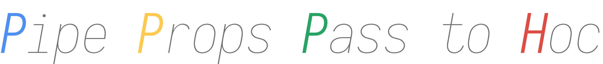

# Pipe Props Pass to Hoc


[](https://juejin.im/entry/5c8fc23de51d4510000a9688/detail)

> install

```bash
yarn add ppph
```

```
npm install ppph -S
```

> desc

```js
/**
 * ---------------------------------------------------------
 * ppph: Pipe Props Pass to Hoc
 * ---------------------------------------------------------
 *
 * before:
 *  <AnyComp p1="p1" p2="p2" />
 * after:
 *  <P2 p1="p1" p2="p2" >
 *    <P1 p1="p1" p2="p2">
 *      <AnyComp p1="p1" p2="p2" />
 *    </P1>
 *  </P2>
 *
 * ---------------------------------------------------------
 * runtime surprise!
 */
```

> use

```js
/**
* the entry:  where `ReactDOM.render(<App />, document.getElementById('#app'))`
*/

import React from 'react';
import ReactDOM from 'react-dom';
import ppph from 'ppph';
import { p1, p2, p3 } from './your/pipes';

ppph.use(p1);
ppph.use(p2);
ppph.inject();

ReactDOM.render(<App />, document.getElementById('#app'));
```

> api

  - use(p: Pipe) => void

  - piper(p: PipeOption) => Pipe

    ```js
    /**
      * -----------------------------------------------
      * pipe type defines
      * -----------------------------------------------
      * ↓ name for pipe
      * @param who required. type: String;
      * ↓ condition to use the pipe
      * @param when required. type: (type, props) => boolean | any;
      * ↓ the HOC for this pipe, means how to deal with it
      * @param how required. type: (Comp: ReactElement) => ReactElement;
      * ↓ a callback will be call when error occur
      * @param why required. type: (e) => void;
      * ↓ pH: means sort weight, just like pH, the lower pH value, the heighter sort weight;",
      * ↓ key: pependent key name in JSX, which will be sort by write order;",
      * @param ph type: [pH, key];
      */
    ```


> example
    [npm run d](./test)

  ```js
  import React, { Component, forwardRef } from 'react';
  import PropTypes from 'prop-types';
  import hoistNonReactStatics from 'hoist-non-react-statics';
  import { piper } from '../../src/main';

  /**
   * --------------------------------------------
   * PipeHOCKeyboardSupport
   * --------------------------------------------
   * introduce your pipeHOC
   */
  const PipeHOCKeyboardSupport = (Comp) => {
    class PipeKeyboardSupportWrapper extends Component {
      static displayName = `PipeKeyboardSupportWrapper${Comp.displayName || Comp.name || ''}`;

      static propTypes = {
        forwardRef: PropTypes.oneOfType([
          PropTypes.func,
          PropTypes.shape({ current: PropTypes.instanceOf(Element) }),
        ]),
        onKeyDown: PropTypes.func,
        onChange: PropTypes.func,
        value: PropTypes.number,
      };

      static defaultProps = {
        forwardRef: null,
        onKeyDown: () => { },
        onChange: () => { },
        value: null,
      }

      onKeyDown = (e) => {
        const { value, onChange } = this.props;
        let next = value;
        if (e.key === 'ArrowUp') {
          try {
            next = +value + 1;
          } catch (error) {
            console.log('onKeyDown error', error);
          }
        }
        if (e.key === 'ArrowDown') {
          try {
            next = +value - 1;
          } catch (error) {
            console.log('onKeyDown error', error);
          }
        }

        onChange(next);
      }

      render() {
        const { props } = this;
        const nextProps = {
          ...props,
          ref: props.forwardRef,
          onKeyDown: this.onKeyDown,
        };
        return <Comp {...nextProps} />;
      }
    }

    // it is not need for ppph, but it better to make your PipeHOC common.
    hoistNonReactStatics(PipeKeyboardSupportWrapper, Comp);
    // forward the ref.
    return forwardRef((props, ref) => <PipeKeyboardSupportWrapper {...props} forwardRef={ref} />);
  };

  /**
   * --------------------------------------------
   * pipe keyboard
   * --------------------------------------------
   * add keyboard support for number input, ArrowUp to add 1, ArrowDown to sub 1
   */
  export default piper({
    who: 'keyboardSupport', // name for pipe
    when: (type, props) => props.kb, // condition to use the pipe
    how: PipeHOCKeyboardSupport, // the HOC for this pipe, means how to deal with it
    why: (e) => { // a callback will be call when error occur.
      console.error('[PipeHOCKeyboardSupport] error: ');
      console.dir(e);
    },
    // pH: means sort weight, just like pH, the lower pH value, the heighter sort weight;
    // key: pependent key name in JSX, which will be sort by write order;
    ph: [7, ''],
  });

  ```

> how

by inject `React.createElement`

> inspired

- [HOC](https://reactjs.org/docs/higher-order-components.html)
- [pexs](https://wnpm.corp.bianlifeng.com/package/@wnpm/pexs)
- [luker](https://wnpm.corp.bianlifeng.com/package/@wnpm/lurker)
- [koa](https://github.com/koajs/koa/)
- [react-powerplug](https://github.com/renatorib/react-powerplug)
- [rematch](https://github.com/rematch/rematch)
- [dva](https://github.com/dvajs/dva)
